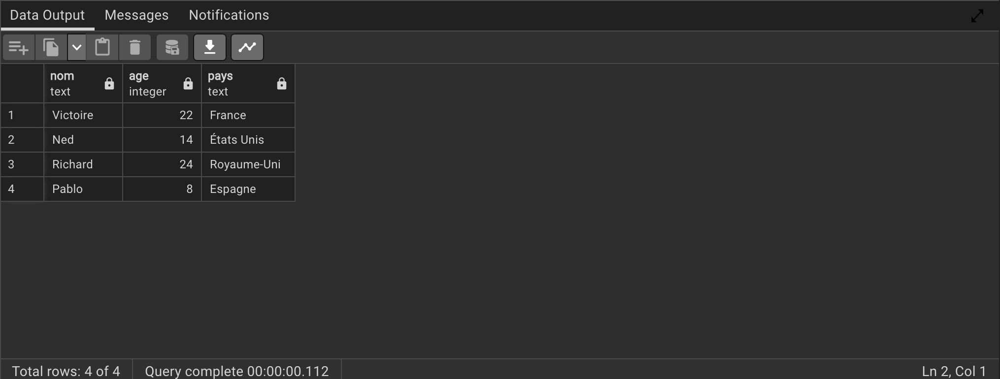

# Introduction à PostgreSQL

## Qu'est-ce qu'un système de gestion de bases de données relationnelles ?

Découvrez les SGBDR et le langage utilisé pour accéder aux grands ensembles de données - **SQL**.

## Qu'est-ce qu'une base de données ?
Une base de données est un ensemble de données stockées dans un ordinateur. Ces données sont généralement structurées de manière à rendre les données facilement accessibles.

## Qu'est-ce qu'une base de données relationnelle ?

Une base de données relationnelle est un type de base de données. Elle utilise une structure qui nous permet d'identifier et d'accéder aux données en relation avec une autre donnée de la base. Souvent, les données d'une base de données relationnelle sont organisées en tables.

## Les tables : Lignes et colonnes

Les tables peuvent contenir des centaines, des milliers, voire des millions de lignes de données. Ces lignes sont souvent appelées **enregistrements**.

Les tables peuvent également comporter de nombreuses colonnes de données. Les colonnes sont étiquetées avec un nom descriptif (par exemple, âge) et ont un type de données spécifique.

Par exemple, une colonne appelée âge peut avoir le type `INTEGER` (indiquant le type de données qu'elle est censée contenir).


| nom      | age | pays        |
|----------|-----|-------------|
| Victoire | 22  | France      |
| Ned      | 14  | États Unis  |
| Richard  | 24  | Royaume-Uni |
| Pablo    | 8   | Espagne     |


Dans le tableau ci-dessus, il y a trois colonnes (nom, âge et pays).

Les colonnes nom et pays stockent des types de données de type chaîne de caractères, tandis que l'âge stocke des types de données entiers. L'ensemble des colonnes et des types de données constitue le schéma de cette table.

La table contient également quatre lignes, ou enregistrements, (un pour Victoire, Ned, Richard et Pablo).

## Qu'est-ce qu'un système de gestion de base de données relationnelle (SGBDR) ?

Un système de gestion de base de données relationnelle (SGBDR) est un programme qui vous permet de créer, de mettre à jour et d'administrer une base de données relationnelle. La plupart des systèmes de gestion de bases de données relationnelles utilisent le langage SQL pour accéder à la base de données.

### Qu'est-ce que le langage SQL ?

SQL (Structured Query Language) est un langage de programmation utilisé pour communiquer avec les données stockées dans un système de gestion de base de données relationnelle. La syntaxe du SQL est similaire à celle de la langue anglaise, ce qui le rend relativement facile à écrire, à lire et à interpréter.

De nombreux SGBDR utilisent SQL (et des variantes de SQL) pour accéder aux données des tables. Par exemple, SQLite est un système de gestion de bases de données relationnelles. SQLite contient un ensemble minimal de commandes SQL (qui sont les mêmes pour tous les SGBDR). D'autres SGBDR peuvent utiliser d'autres variantes.

(SQL se prononce souvent de deux façons. Vous pouvez le prononcer en prononçant chaque lettre individuellement comme "S-Q-L", ou le prononcer en utilisant le mot "suite").

Systèmes populaires de gestion de bases de données relationnelles
La syntaxe SQL peut différer légèrement en fonction du SGBDR que vous utilisez. Voici une brève description des SGBDR populaires :

#### MySQL

MySQL est la base de données SQL open source la plus populaire. Elle est généralement utilisée pour le développement d'applications Web, et on y accède souvent à l'aide de PHP.

Les principaux avantages de MySQL sont qu'il est facile à utiliser, peu coûteux, fiable (il existe depuis 1995) et qu'il dispose d'une grande communauté de développeurs qui peuvent aider à répondre aux questions.

Certains de ses inconvénients sont qu'il est connu pour souffrir de mauvaises performances lors de la mise à l'échelle, que le développement open source a pris du retard depuis qu'Oracle a pris le contrôle de MySQL, et qu'il n'inclut pas certaines fonctionnalités avancées auxquelles les développeurs peuvent être habitués.


#### PostgreSQL

PostgreSQL est une base de données SQL open source qui n'est contrôlée par aucune société. Elle est généralement utilisée pour le développement d'applications web.

PostgreSQL partage beaucoup des mêmes avantages que MySQL. Il est facile à utiliser, peu coûteux, fiable et dispose d'une grande communauté de développeurs. Il offre également certaines fonctionnalités supplémentaires, telles que le support des clés étrangères, sans nécessiter de configuration complexe.

Le principal inconvénient de PostgreSQL est que ses performances peuvent être plus lentes que celles d'autres bases de données telles que MySQL. Il est également légèrement moins populaire que MySQL.


#### Oracle DB

Oracle Corporation possède Oracle Database, et le code n'est pas open source.

Oracle DB est destiné aux grandes applications, notamment dans le secteur bancaire. La plupart des grandes banques du monde utilisent des applications Oracle, car Oracle offre une combinaison puissante de technologies et d'applications commerciales complètes et pré-intégrées, y compris des fonctionnalités essentielles conçues spécifiquement pour les banques.

Le principal inconvénient d'Oracle est qu'il n'est pas libre d'utilisation comme ses concurrents open source et qu'il peut être assez cher.

#### SQL Server

Microsoft possède SQL Server. Comme Oracle DB, le code est à source fermée.

Les grandes applications d'entreprise utilisent principalement SQL Server.

Microsoft propose une version d'entrée de gamme gratuite appelée Express, mais elle peut devenir très coûteuse à mesure que vous faites évoluer votre application.

#### SQLite

SQLite est une base de données SQL open source populaire. Elle peut stocker une base de données entière dans un seul fichier. L'un des avantages les plus significatifs est que toutes les données peuvent être stockées localement sans avoir à connecter votre base de données à un serveur.

SQLite est un choix populaire pour les bases de données dans les téléphones portables, les PDA, les lecteurs MP3, les décodeurs et autres gadgets électroniques.

### Conclusion

Les bases de données relationnelles stockent les données dans des tables. Les tables peuvent devenir très grandes et comporter une multitude de colonnes et d'enregistrements. Les systèmes de gestion de bases de données relationnelles (SGBDR) utilisent SQL (et des variantes de SQL) pour gérer les données de ces grandes tables. Le SGBDR que vous utilisez est votre choix et dépend de la complexité de votre application.


## Vue d'ensemble de SQL

SQL, **S**tructured **Q**uery **L**anguage, est un langage de programmation conçu pour gérer les données stockées dans des bases de données relationnelles. SQL fonctionne par le biais d'instructions simples et déclaratives. Cela permet de conserver des données précises et sécurisées, et de maintenir l'intégrité des bases de données, quelle que soit leur taille.

Le langage SQL est largement utilisé aujourd'hui dans les framework Web et les applications de base de données. La connaissance de SQL vous donne la liberté d'explorer vos données et le pouvoir de prendre de meilleures décisions. En apprenant SQL, vous apprendrez également des concepts qui s'appliquent à presque tous les systèmes de stockage de données.

### À vous de jouer ! 🤠

1. Lancez `pgAdmin4`.


2. Créez une base de données `introduction`
  1. Servers > PostgreSQL > Databases
  2. Clic droit sur `Databases` puis sélectionnez ` Create > Database`.
  3. Entrez le nom `introduction` puis cliquer sur `Save`
  4. Sélectionnez `introduction` et cliquez sur `Query Tool` pour exécuter des scripts.


3. Copier-Coller le code suivant dans l'éditeur de requêtes.
```sql
CREATE TABLE personnes (
   nom TEXT,
   age INTEGER,
   pays TEXT
);
INSERT INTO personnes (nom, age, pays)
VALUES ('Victoire', 22, 'France');
INSERT INTO personnes (nom, age, pays)
VALUES ('Ned', 14, 'États Unis');
INSERT INTO personnes (nom, age, pays)
VALUES ('Richard', 24, 'Royaume-Uni');
INSERT INTO personnes (nom, age, pays)
VALUES ('Pablo', 8, 'Espagne');
```

4. Exécutez le code.

5. Afin de s'assurer que tout c'est bien passé Copiez-Collez et exécutez le code suivant:
```sql
SELECT * FROM personnes;
```

6. Si tout ok, vous devriez avoir le résultat suivant:



## Bases de données relationnelles

Beau travail ! En une ligne de code, vous avez renvoyé les informations d'une base de données relationnelle.

```sql
SELECT * FROM personnes ;
```

Nous verrons bientôt ce que signifie ce code, mais pour l'instant, concentrons-nous sur ce que sont les bases de données relationnelles et comment elles sont organisées.

Une base de données relationnelle est une base de données qui organise les informations dans une ou plusieurs tables. Ici, la base de données relationnelle contient une table.

Une table est un ensemble de données organisées en lignes et en colonnes. Les tables sont parfois appelées relations. Ici, la table concerne les célébrités.

Une colonne est un ensemble de valeurs de données d'un type particulier. Ici, l'identifiant, le nom et l'âge sont les colonnes.

Une ligne est un enregistrement unique dans une table. La première ligne de la table celebs a :
- Un nom de "Victoire"
- Un age de 22
- Un pays de "France"

Toutes les données stockées dans une base de données relationnelle sont d'un certain type. Parmi les types de données les plus courants, citons

- `INTEGER`, un nombre entier positif ou négatif
- `TEXT`, une chaîne de texte
- `DATE`, une date formatée sous la forme AAAA-MM-JJ
- `REAL`, une valeur décimale

## Déclarations

Le code ci-dessous est une instruction SQL. Une instruction est un texte que la base de données reconnaît comme une commande valide. Les instructions se terminent toujours par un point-virgule `;`.

```sql
CREATE TABLE nom_table (
   column_1 data_type,
   column_2 data_type,
   column_3 data_type
);
```
Décomposons les composants de cette déclaration :

1. `CREATE TABLE` est une clause. Les clauses effectuent des tâches spécifiques en SQL. Par convention, les clauses sont écrites en lettres majuscules. Les clauses peuvent également être appelées des commandes.

2. `nom_table` fait référence au nom de la table à laquelle la commande est appliquée.

3. (column_1 data_type, column_2 data_type, column_3 data_type) est un paramètre. Un paramètre est une liste de colonnes, de types de données ou de valeurs qui sont transmises à une clause en tant qu'argument. Ici, le paramètre est une liste de noms de colonnes et du type de données associé.

La structure des instructions SQL est variable. Le nombre de lignes utilisées n'a pas d'importance. Une instruction peut être écrite sur une seule ligne, ou répartie sur plusieurs lignes si cela facilite la lecture. Dans ce cours, vous vous familiariserez avec la structure des instructions courantes.

### A vous de jouer ! 🤠

Regardons de plus près la déclaration que nous avons écrite précédemment. Dans l'éditeur de code :

```sql
SELECT * FROM personnes ;
```

1. Exécutez le code pour observer les résultats, et demandez-vous :

    - Quelles parties de l'instruction sont des clauses ?
    - À quelle table appliquons-nous la commande ?
    - Découvrez l'astuce pour afficher les réponses, puis passez à l'exercice suivant.
    <details>
  <summary>Indice 🔑</summary>
    <p><b>SELECT</b> et <b>FROM</b> sont les clauses ici.</p>
    <p>Nous appliquons la commande à la table personnes.</p>
    <p>Bientôt, vous en saurez plus sur chaque partie de cette instruction !</p>
  </details>


  ## Create

  L'instruction `CREATE` permet de créer une nouvelle table dans la base de données. Vous pouvez utiliser l'instruction CREATE à chaque fois que vous souhaitez créer une nouvelle table à partir de zéro. L'instruction ci-dessous crée une nouvelle table nommée celebs.


  ```sql
  CREATE TABLE personnes (
     nom TEXT,
     age INTEGER,
     pays TEXT
  );
  ```

  1. `CREATE TABLE` est une clause qui indique à `SQL` que vous voulez créer une nouvelle table.
  2. `personnes` est le nom de la table.
  3. ( nom TEXT, age INTEGER, pays TEXT) est une liste de paramètres définissant chaque colonne, ou attribut de la table et son type de données :

  - `nom` est la première colonne de la table. Elle contient des valeurs de type `TEXT`
  - `age` est la seconde colonne du tableau. Elle stocke les valeurs du type de données `INTEGER`
  - `pays` est la première colonne de la table. Elle contient des valeurs de type `TEXT`


  ### A vous de jouer ! 🤠

  1.  Maintenant que vous avez une bonne compréhension de la syntaxe SQL, nous pouvons créer une nouvelle table. Nous avons effacé la base de données des exercices précédents. Confirmez qu'aucune table celebs n'existe en entrant ce qui suit dans l'éditeur de code :

      ```sql
      SELECT * FROM celebrites;
      ```

      Regardez le résultat.Vous devriez avoir l'erreur suivante:

      ```
      ERROR:  relation "celebrites" does not exist
      ```

  2. Maintenant que nous savons que la base de données ne contient pas cette table, créons une nouvelle table `celebrites`.

      Dans l'éditeur de code, tapez :

      ```sql
      CREATE TABLE celebrites (
         id INTEGER,
         nom TEXT,
         age INTEGER
      );
  ```

  Nous apprendrons comment visualiser ce tableau dans un exercice ultérieur, après y avoir ajouté des données.


  ## Insert

  L'instruction `INSERT` insère une nouvelle ligne dans une table.

  On peut utiliser l'instruction `INSERT` quand on veut ajouter de nouveaux enregistrements. L'instruction ci-dessous insère un enregistrement pour Justin Bieber dans la table celebs.


  ```sql
  INSERT INTO celebrites (id, nom, age)
  VALUES (1, 'Justin Bieber', 22);
  ```

  - `INSERT INTO` est une clause qui ajoute la ou les lignes spécifiées.
  - `celebrites` est le tableau dans lequel la ligne est ajoutée.
  - `(id, nom, age)` est un paramètre identifiant les colonnes dans lesquelles les données seront insérées.
  - `VALUES` est une clause qui indique les données à insérer.
  - (1, 'Justin Bieber', 22) est un paramètre identifiant les valeurs à insérer.
      - 1: un nombre entier qui sera ajouté à la colonne id
      - 'Justin Bieber': texte qui sera ajouté à la colonne nom
      - 22: un nombre entier qui sera ajouté à la colonne d'âge


  ### A vous de jouer ! 🤠 🤠

  1. Ajoutez une ligne au tableau. Dans l'éditeur de code, tapez :
  ```sql
  INSERT INTO celebrites (id, nom, age)
  VALUES (1, 'Justin Bieber', 22);
  ```
  Regardez le schéma de la base de données. Combien de lignes y a-t-il dans la table celebs ?

  2. Ajoutez trois autres célébrités à la table. Sous votre déclaration `INSERT` précédente, tapez :
  ```sql
  INSERT INTO celebrites (id, nom, age)
  VALUES (2, 'Beyonce Knowles', 33);

  INSERT INTO celebrites (id, nom, age)
  VALUES (3, 'Jeremy Lin', 26);

  INSERT INTO celebrites (id, nom, age)
  VALUES (4, 'Taylor Swift', 26);
  ```


  ## Select

Les instructions `SELECT` sont utilisées pour extraire des données d'une base de données. Dans l'instruction ci-dessous, `SELECT` renvoie toutes les données de la colonne nom de la table `celebrites`.

```sql
SELECT nom FROM celebrites;
```

1. `SELECT` est une clause qui indique que l'instruction est une requête. Vous utiliserez `SELECT` chaque fois que vous interrogerez des données dans une base de données.
2. `nom` spécifie la colonne à partir de laquelle interroger les données.
3. `FROM celebrites` indique le nom de la table à partir de laquelle les données doivent être interrogées. Dans cette instruction, les données sont interrogées à partir de la table `celebrites`.

Vous pouvez également interroger les données de toutes les colonnes d'un tableau avec `SELECT`.

```sql
SELECT * FROM celebrites;
```

`*` est un caractère générique spécial que nous utilisons. Il vous permet de sélectionner toutes les colonnes d'un tableau sans avoir à les nommer individuellement. Ici, le jeu de résultats contient toutes les colonnes de la table celebs.

`SELECT` renvoient toujours un nouveau tableau appelé le jeu de résultats.


### A vous de jouer ! 🤠 🤠

1. Examinons de plus près la méthode `SELECT` et récupérons tous les noms de la table `celebrites`. Dans l'éditeur de code, tapez :
```sql
SELECT nom FROM celebrites;
```

2. Supprimez votre instruction `SELECT` précédente de l'éditeur de code.

3. SÉLECTIONNER toutes les données de la table celebs, saisissez l'instruction suivante dans l'éditeur de code en utilisant le caractère générique `*` :
```sql
SELECT * FROM celebrites;
```

## Alter
L'instruction `ALTER TABLE` ajoute une nouvelle colonne à une table. Vous pouvez utiliser cette commande lorsque vous souhaitez ajouter des colonnes à une table. L'instruction ci-dessous ajoute une nouvelle colonne `contact_twitter` à la table `celebrites`.

```sql
ALTER TABLE celebrites
ADD COLUMN contact_twitter TEXT;
```

1. `ALTER TABLE` est une clause qui vous permet d'effectuer les modifications spécifiées.
2. `celebrite`s est le nom de la table qui est modifiée.
3. `ADD COLUMN` est une clause qui vous permet d'ajouter une nouvelle colonne à une table :
    - `contact_twitter` est le nom de la nouvelle colonne qui est ajoutée.
    - `TEXT` est le type de données pour la nouvelle colonne.

4. `NULL` est une valeur spéciale en SQL qui représente des données manquantes ou inconnues. Ici, les lignes qui existaient avant l'ajout de la colonne ont des valeurs NULL (∅) pour `contact_twitter`.


### A vous de jouer ! 🤠

1. Ajoutez une nouvelle colonne au tableau. Dans l'éditeur de code, tapez :

```sql
ALTER TABLE celebrites
ADD COLUMN contact_twitter TEXT;

SELECT * FROM celebrites;
```


### Update

L'instruction `UPDATE` modifie une ligne dans une table. Vous pouvez utiliser l'instruction `UPDATE` lorsque vous souhaitez modifier des enregistrements existants. L'instruction ci-dessous met à jour l'enregistrement dont la valeur de l'identifiant est 4 et qui a le `contact_twitter` en  `@taylorswift13`.

```sql
UPDATE celebrites
SET contact_twitter = '@taylorswift13'
WHERE id = 4;
```


1. `UPDATE` est une clause qui modifie une ligne de la table.
2. `celebrites` est le nom de la table.
3. `SET` est une clause qui indique la colonne à modifier.
    - contact_twitter est le nom de la colonne qui va être mise à jour.
    - @taylorswift13 est la nouvelle valeur qui va être insérée dans la colonne contact_twitter.
4. `WHERE` est une clause qui indique la ou les lignes à mettre à jour avec la nouvelle valeur de la colonne. Ici, la ligne avec un 4 dans la colonne id est la ligne qui aura le contact_twitter mis à jour en @taylorswift13.


### A vous de jouer !

1. Mettez à jour le tableau pour inclure l'identifiant twitter de Taylor Swift. Dans l'éditeur de code, tapez :

```sql
UPDATE celebrites
SET contact_twitter = '@taylorswift13'
WHERE id = 4;

SELECT * FROM celebrites;
```


## Delete

L'instruction `DELETE FROM` permet de supprimer une ou plusieurs lignes d'une table. Vous pouvez utiliser cette instruction lorsque vous souhaitez supprimer des enregistrements existants. L'instruction ci-dessous supprime tous les enregistrements de la table celebrites sans contact_twitter :

```sql
DELETE FROM celebrites
WHERE contact_twitter IS NULL;
```

1. `DELETE FROM` est une clause qui vous permet de supprimer des lignes d'une table.
2. `celebrites` est le nom de la table dont nous voulons supprimer les lignes.
3. `WHERE` est une clause qui vous permet de sélectionner les lignes que vous souhaitez supprimer. Ici, nous voulons supprimer toutes les lignes où la colonne `contact_twitter` `EST NULL`.
4. `IS NULL` est une condition en SQL qui renvoie vrai lorsque la valeur est NULL et faux sinon.

### A vous de jouer ! 🤠

Supprimez toutes les lignes qui ont une valeur NULL dans la colonne `contact_twitter`. Dans l'éditeur de code, tapez ce qui suit :


```sql
DELETE FROM celebrites
WHERE contact_twitter IS NULL;

SELECT * FROM celebrites;
```

Combien de lignes y a-t-il dans le tableau des célébrités maintenant ?
