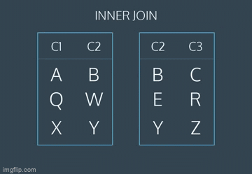

# Tables multiples

## Introduction

Afin de stocker efficacement les données, nous répartissons souvent les informations connexes dans plusieurs tables.

Par exemple, imaginons que nous gérons une maison d'édition où les utilisateurs peuvent avoir différents types d'abonnements à différents produits. Les différents abonnements peuvent avoir de nombreuses propriétés différentes. Chaque client aurait également de nombreuses informations associées.

Nous pourrions avoir une table contenant toutes les informations suivantes :

- `id_commande`
- `id_client`
- `nom_client`
- `adresse_client`
- `id_abonnement`
- `description_abonnement`
- `prix_mois_abonnement`
- `duree_abonnement`
- `date_achat`

Toutefois, un grand nombre de ces informations seraient répétées. Si le même client a plusieurs abonnements, le nom et l'adresse de ce client seront indiqués plusieurs fois. Si le même type d'abonnement est commandé par plusieurs clients, le prix et la description de l'abonnement seront répétés. Cela rendra notre tableau gros et ingérable.

Au lieu de ça, nous séparons nos données dans 3 tables différentes.

1. `commandes` ne contient  les informations nécessaires pour décrire ce qui a été commandé :

    - `id_commande`, `id_client`, `id_abonnement`, `date_achat`


2. `abonnements` contient les informations nécessaires pour décrire chaque type d'abonnement :

    - `id_abonnement`, `description`, `prix_mensuel`, `duree_abonnement`
    
3. `clients` contiennent les informations relatives à chaque client :

     - `id_client`, `nom_client`, `adresse`

     
Dans cette leçon, nous allons apprendre les commandes SQL qui nous aideront à travailler avec des données stockées dans plusieurs tables.

### A vous de jouer ! 🤠

1. Créez une nouvelle database nommée `tables_multiples` et charger dans l'éditeur de requête le contenu de `DATABASE_MaisonEdition.sql`

2. Examinons les 3 tables.


### Solution
```sql
SELECT *
FROM commandes
LIMIT 5;
 
SELECT *
FROM abonnements
LIMIT 5;
 
SELECT * 
FROM clients
LIMIT 5;
```

## Combiner les tables manuellement

Revenons à notre maison d'édition. Supposons que nous ayons les trois tableaux décrits dans l'exercice précédent - affiché ci-dessous (nous allons essayer quelque chose de nouveau !):

- commandes
- abonnements
- clients

Si nous ne regardons que la table des `commandes`, nous ne pouvons pas vraiment dire ce qui s'est passé pour chaque commande. Cependant, si nous nous référons aux autres tables, nous pouvons obtenir une image complète.

Examinons la commande dont le numéro de commande est 2 et qui a été achetée par le client dont le numéro de client est 2.

Pour connaître le nom du client, nous consultons la table `clients` et recherchons l'élément dont la valeur `id_client` est `2`. Nous constatons que le nom du client 2 est "Jacqueline Derna" et qu'elle habite au "12 Rue du Vieux Port, 13002 Marseille".

Ce type de correspondance s'appelle la jonction de deux tables.


### A vous de jouer ! 🤠

1. À l'aide des tables affichées, quelle est la description du magazine commandé dans l'`id_commande`  1 ?

    - Veillez à utiliser les mêmes majuscules que dans le tableau.
    
2. En utilisant les tables affichées, quel est le `nom_client` du client de l'`id_commande` 3 ?

    - Veillez à mettre la même majuscule que dans la table.
    

## Combinaison de tables avec SQL

Combiner des tables manuellement prend beaucoup de temps. Heureusement, SQL nous offre une séquence facile pour cela : il s'agit d'un `JOIN`.

Si nous voulons combiner les commandes et les clients, nous devons taper :
```sql
SELECT *
FROM commandes
JOIN clients
  ON commandes.id_client = clients.id_client;
```

Décomposons cette commande :

1. La première ligne sélectionne toutes les colonnes de notre tableau combiné. Si nous ne voulons sélectionner que certaines colonnes, nous pouvons spécifier celles que nous voulons.

2. La deuxième ligne spécifie la première table dans laquelle nous voulons regarder, commandes

3. La troisième ligne utilise `JOIN` pour indiquer que nous voulons combiner les informations des `commandes` avec celles des `clients`.

4. La quatrième ligne nous indique comment combiner les deux tables. Nous voulons faire correspondre la colonne id_client de la table commandes avec la colonne `id_client` de la table `clients`.

Les noms de colonnes étant souvent répétés dans plusieurs tables, nous utilisons la syntaxe `nom_table.nom_colonne` pour nous assurer que nos demandes de colonnes sont sans ambiguïté. 

Dans notre exemple, nous utilisons cette syntaxe dans l'instruction `ON`, mais nous l'utiliserons également dans l'instruction `SELECT` ou toute autre instruction où nous faisons référence à des noms de colonnes.

Par exemple : Au lieu de sélectionner toutes les colonnes en utilisant `*`, si nous voulions uniquement sélectionner la colonne `` de la table orders et la colonne `nom_client` de la table `clients`, nous pourrions utiliser la requête suivante :


```sql
SELECT commandes.id_commande,
   clients.nom_client
FROM commandes
JOIN clients
  ON commandes.id_client = clients.id_client;
```

### A vous de jouer !

1. Joignez la table des `commandes` et la table des `abonnements` et sélectionnez toutes les colonnes.

    Veillez à effectuer la jointure sur la colonne `id_abonnement`.


2. Ne supprimez pas la requête précédente.

    Ajoutez une deuxième requête après la première, qui sélectionne uniquement les lignes de la jointure où la description est égale à "Art de la Mode".

### SOLUTION

-- Première requête
SELECT *
FROM commandes
JOIN abonnements
    ON commandes.id_abonnement = abonnements.id_abonnement;

-- Seconde requête
SELECT *
FROM commandes
JOIN abonnements
    ON commandes.id_abonnement = abonnements.id_abonnement
WHERE abonnements.description = 'Art de la Mode';


## Inner Joins ou jointures internes

Revoyons comment nous avons joint les commandes et les clients. Pour chaque valeur possible de l'id_client dans les commandes, il existe une ligne correspondante de clients avec le même id_client.

Et si ce n'était pas le cas ?

Imaginons par exemple que notre table des clients soit obsolète et qu'il manque des informations sur le client 11. Si ce client avait une commande dans les commandes, que se passerait-il lorsque nous joindrions les tables ?

Lorsque nous effectuons une simple jointure (souvent appelée jointure interne), notre résultat ne comprend que les lignes qui correspondent à notre condition `ON`.

Considérez l'animation suivante, qui illustre une jointure interne de deux tables sur table1.c2 = table2.c2 :



La première et la dernière rangée ont des valeurs correspondantes de c2. Les rangées du milieu ne correspondent pas. Le résultat final contient toutes les valeurs de la première et de la dernière rangée, mais pas la rangée du milieu qui ne correspond pas.

### A vous de jouer !

Supposons que nous travaillons pour un journal qui propose deux types d'abonnements :

    - journal imprimé
    - articles en ligne
    
Certains utilisateurs s'abonnent uniquement au journal, d'autres uniquement à l'édition en ligne, et d'autres encore aux deux.

Il existe une table `abonnés_journal_papier` qui contient des informations sur les abonnés au journal.

1. Comptez le nombre d'abonnés qui reçoivent un journal  en utilisant `COUNT()`.

2. Ne supprimez pas votre requête précédente.

    - Il existe également une table `abonnés_journal_web` qui contient des informations sur les abonnés en ligne.

    - Comptez le nombre d'abonnés qui reçoivent un journal en ligne en utilisant `COUNT()`.


3. Ne supprimez pas vos requêtes précédentes.

    - Joignez la table `abonnés_journal_papier` et la table `abonnés_journal_web` sur leurs colonnes id (l'identifiant unique de l'abonné).

    - Combien de lignes y a-t-il dans cette table ?

### SOLUTION

```sql
SELECT COUNT(*)
FROM abonnés_journal_papier;

SELECT COUNT(*)
FROM abonnés_journal_web;

SELECT COUNT(*)
FROM abonnés_journal_papier
JOIN abonnés_journal_web
    ON abonnés_journal_papier.id = abonnés_journal_web.id;
```


## Jointures à gauche ou LEFT JOIN

Que faire si nous voulons combiner deux tables et conserver certaines des lignes non correspondantes ?

SQL nous permet de le faire grâce à une commande appelée `LEFT JOIN`. Une jointure gauche conserve toutes les lignes de la première table, qu'il y ait ou non une ligne correspondante dans la deuxième table.

Considérons l'animation suivante :


La première et la dernière rangée ont des valeurs correspondantes de c2. Les lignes du milieu ne correspondent pas. Le résultat final conservera toutes les lignes du premier tableau mais omettra la ligne non correspondante du second tableau.

Cette animation représente une opération de table produite par la commande suivante :

```sql
SELECT *
FROM table1
LEFT JOIN table2
  ON table1.c2 = table2.c2;
```

1. La première ligne sélectionne toutes les colonnes des deux tables.
2. La seconde ligne sélectionne la table 1 (la table "gauche").
3. La troisième ligne effectue un `LEFT JOIN` sur la table 2 (la table " droite ").
4. La quatrième ligne indique à SQL comment effectuer la jointure (en recherchant les valeurs correspondantes dans la colonne c2).

### A vous de jouer ! 🤠

Revenons à nos abonnés en ligne et sur papier.

Supposons que nous voulions savoir combien d'utilisateurs sont abonnés au journal papié, mais pas au journal en ligne.

1. Commencez par effectuer une jointure gauche de la table du `abonnés_journal_papier` et de la table en `abonnés_journal_web` sur leurs colonnes `id` et sélectionnez toutes les colonnes.

    Ne supprimez pas votre requête précédente.

    Afin de trouver les utilisateurs qui ne s'abonnent pas à l'édition en ligne, nous devons ajouter une clause `WHERE`.


2. Ajoutez une deuxième requête après la première, en ajoutant la clause `WHERE` et la condition suivantes :

    `WHERE abonnés_journal_web.id IS NULL`

    Cela permettra de sélectionner les lignes pour lesquelles il n'y avait pas de ligne correspondante dans le tableau en ligne.

### Solution

```sql

-- Première requête
SELECT *
FROM abonnés_journal_papier
LEFT JOIN abonnés_journal_web
    ON abonnés_journal_papier.id = abonnés_journal_web.id;
  
-- Seconde requête
SELECT *
FROM abonnés_journal_papier
LEFT JOIN abonnés_journal_web
    ON abonnés_journal_papier.id = abonnés_journal_web.id
WHERE abonnés_journal_web.id IS NULL;
```

## Clé primaire et clé étrangère

Revenons à notre exemple d'abonnements à un journal. Rappelez-vous que nous avions trois tables : `commandes`, `abonnements` et `clients`.

Chacune de ces tables possède une colonne qui identifie de manière unique chaque ligne de cette table :

- `id_commande` pour les commandes
- `id_abonnement` pour les abonnements
- `id_client` pour les clients

Ces colonnes spéciales sont appelées **clés primaires**.

Les clés primaires ont quelques exigences :

- Aucune des valeurs ne peut être `NULL`.
- Chaque valeur doit être unique (par exemple, vous ne pouvez pas avoir deux clients avec le même `id_client` dans la table `clients`).

> Une table ne peut pas avoir plus d'une colonne de clé primaire.

Réexaminons la table commande :

| id_commande | id_abonnement | id_client | date_achat |
|-------------|---------------|-----------|------------|
| 1           | 2             | 3         | 2017-01-01 |
| 2           | 2             | 2         | 2017-01-01 |
| 3           | 3             | 1         | 2017-01-01 |


Notez que `id_client` (la clé primaire des clients) et `id_abonnement` (la clé primaire des abonnements) y figurent tous deux.

Lorsque la **clé primaire** d'une table apparaît dans une autre table, il s'agit d'une **clé étrangère**.

Ainsi, `id_client`  est une clé primaire lorsqu'il apparaît dans `clients`, mais une clé étrangère lorsqu'il apparaît dans `commandes`.

Dans cet exemple, nos clés primaires ont toutes des noms assez descriptifs. En général, la clé primaire s'appelle simplement `id`. Les clés étrangères auront des noms plus descriptifs.

Pourquoi est-ce important ? Les types de jointures les plus courants consistent à joindre une clé étrangère d'une table à la clé primaire d'une autre table. Par exemple, lorsque nous jointons des commandes et des clients, nous le faisons sur `id_client`, qui est une clé étrangère dans les `commandes` et la clé primaire dans les `clients`.


### A vous de jouer ! 🤠

Supposons que l'ECAM possède deux tables dans sa base de données :

- La table `cours` contient des informations sur les cours que l'école propose. Sa clé primaire est `id`.
- La table `etudiants` contient des informations sur tous les étudiants de l'école. Sa clé primaire est `id`- Elle contient la clé étrangère `id_cours`, qui correspond à la clé primaire des `cours`.

1. Effectuez une jointure interne des `cours` et des `etudiants` en utilisant les clés primaires et étrangères décrites ci-dessus, et sélectionnez toutes les colonnes.

    <details>
        <summary>Si je suis bloqué 🆘</summary>
    <p>Votre déclaration <b>ON</b> doit inclure :</p>
    <ul>
        <li>cours.id (une clé primaire)</li>
        <li>etudiants.id_cours (une clé étrangère)</li>
    </ul>
    <p>Elle doit ressembler à ceci</p>
        <code>
            SELECT *
            FROM cours
            JOIN etudiants
              ON cours.id = etudiants.id_cours ;
        <code>
        <p>Vous devriez déjà savoir comment effectuer cette jointure. Mais dans cet exercice, vous avez appris que la colonne de jointure est généralement une <b>clé primaire</b> d'une table et une <b>clé étrangère </b> d'une autre !</p>
    </details>


### Solution

```sql
SELECT *
         FROM cours
         JOIN etudiants
           ON cours.id = etudiants.id_cours ;
```

## Cross Join ou Jointure croisée

Jusqu'à présent, nous nous sommes concentrés sur la mise en correspondance de lignes qui ont des informations en commun.

Parfois, nous voulons simplement combiner toutes les lignes d'une table avec toutes les lignes d'une autre table.

Par exemple, si nous disposons d'une table `chemises` et d'une table `pantalons`, nous pouvons souhaiter connaître toutes les combinaisons possibles pour créer différentes tenues.

Notre code pourrait ressembler à ceci :

```sql
SELECT chemises.couleur_chemise,
   pantalons.couleur_pantalon
FROM chemises
CROSS JOIN pantalons;
```

- Les deux premières lignes sélectionnent les colonnes `couleur_chemise` et `couleur_pantalon`.
- La troisième ligne extrait les données de la table `chemises`.
- La quatrième ligne effectue une jointure croisée avec `pantalon`.

Remarquez que les jointures croisées ne nécessitent pas d'instruction **ON**. Vous n'effectuez pas vraiment de jointure sur des colonnes !

Si nous avons 3 chemises différentes (`blanche`, `grise` et `olive`) et 2 pantalons différents (`jean_clair` et `noir`), les résultats pourraient ressembler à ceci :

| couleur chemise | couleur pantalon |
|-----------------|------------------|
| blanc           | jean_clair       |
| blanc           | noir             |
| gris            | jean_clair       |
| gris            | noir             |
| olive           | jean_clair       |
| olive           | noir             |


3 chemises × 2 pantalons = 6 combinaisons !

Cet exemple de vêtements est amusant, mais il n'est pas très utile en pratique.

Une utilisation plus courante de `CROSS JOIN` consiste à comparer chaque ligne d'un tableau à une liste de valeurs.

Revenons à nos abonnements de journaux. Cette table contient deux colonnes dont nous n'avons pas encore parlé :

- debut_mois : le premier mois où le client s'est abonné au journal papier (par exemple, 2 pour février)

- fin_mois : le dernier mois où le client s'est abonné au journal papier.

Supposons que nous voulions savoir combien d'utilisateurs se sont abonnés au cours de chaque mois de l'année. Pour chaque mois (1, 2, 3), nous devons savoir si un utilisateur est abonné.

Suivez les étapes ci-dessous pour voir comment nous pouvons utiliser un `CROSS JOIN` pour résoudre ce problème.

### A vous de jouer !  🤠

Nous utiliserons plus tard une jointure croisée pour nous aider, mais d'abord, essayons un problème plus simple.

1. Commençons par compter le nombre de clients qui se sont abonnés au journal au cours du mois de `mars`.

Utilisez `COUNT(*)` pour compter le nombre de lignes et une clause `WHERE` pour restreindre à deux conditions :


- `debut_mois <= 3`
- `fin_mois >= 3`


***Ne supprimez pas la requête précédente.***

La requête précédente nous permet d'enquêter sur un mois à la fois. Afin de vérifier tous les mois, nous allons devoir utiliser une **jointure croisée**.

Notre base de données contient une autre table appelée `mois` qui contient les nombres entre `1` et `12`.

2. Sélectionnez toutes les colonnes de la jointure croisée de `journaux` et  `mois`.

***Ne supprimez pas vos requêtes précédentes.***

3. Créez une troisième requête où vous ajoutez une instruction `WHERE` à votre jointure croisée pour restreindre à deux conditions :

- `debut_mois <= mois`
- `fin_mois >= mois`

Cela permettra de sélectionner tous les mois où un utilisateur était abonné.


Ne supprimez pas vos requêtes précédentes.

4. Créez une dernière requête où vous agrégez sur chaque mois pour compter le nombre d'abonnés.

Remplissez les espaces vides de la requête suivante :

```sql
SELECT mois,
  COUNT(*)
FROM ________
CROSS JOIN ________
WHERE ________ AND ________
GROUP BY ________;
```

### SOLUTION

```sql
SELECT COUNT(*)
FROM abonnés_journal_papier
WHERE debut_mois <= 3 
  AND fin_mois >= 3;
  
SELECT *
FROM abonnés_journal_papier
CROSS JOIN mois;

SELECT *
FROM abonnés_journal_papier
CROSS JOIN mois
WHERE debut_mois <= mois 
  AND fin_mois >= mois;

SELECT mois, 
  COUNT(*)
FROM abonnés_journal_papier
CROSS JOIN mois
WHERE debut_mois <= mois 
  AND fin_mois >= mois
GROUP BY mois;
```

## Union

Parfois, nous voulons simplement empiler un ensemble de données par-dessus un autre. Eh bien, l'opérateur `UNION` nous permet de le faire.

Supposons que nous ayons deux tables et qu'elles aient les mêmes colonnes.

`table1`:

| pokemon    | type   |
|------------|--------|
| Bulbizarre | Plante |
| Salamèche  | Feu    |
| Carapuce   | Eau    |

`table2`:

| pokemon | type   |
|---------|--------|
| Ronflex | Normal |


Si on combine ces deux-là avec UNION :

```sql
SELECT *
FROM table1
UNION
SELECT *
FROM table2;
```

| pokemon    | type   |
|------------|--------|
| Bulbizarre | Plante |
| Salamèche  | Feu    |
| Carapuce   | Eau    |
| Ronflex    | Normal |

Le résultat sera :

SQL a des règles strictes pour l'ajout de données :

- Les tables doivent avoir le même nombre de colonnes.
- Les colonnes doivent avoir les mêmes types de données et dans le même ordre que la première table.


### A vous de jouer ! 🤠

1. Revenons à notre journal et à nos abonnements en ligne. Nous aimerions créer un seul grand tableau avec les deux ensembles de données.

    Utilisez `UNION` pour empiler la table `abonnés_journal_papier` sur le table `abonnés_journal_web`.


### SOLUTION

```sql
SELECT *
FROM abonnés_journal_papier
UNION
SELECT *
FROM abonnés_journal_web;
```

## WITH

Souvent, nous voulons combiner deux tableaux, mais l'un des tableaux est le résultat d'un autre calcul.

Revenons à notre exemple de commande de `abonnés_journal_papier`. Notre service marketing pourrait vouloir en savoir un peu plus sur nos clients. Par exemple, il pourrait vouloir connaître le nombre de magazines auxquels chaque client est abonné. Nous pouvons facilement le calculer à l'aide de notre table de `commandes` :

```sql
SELECT id_client,
   COUNT(id_abonnement) AS 'abonnements'
FROM commandes
GROUP BY id_client;
```

Cette requête est bonne, mais le numéro d'identification du client n'est pas très utile pour notre service marketing, qui souhaite probablement connaître le nom du client.

Nous voulons pouvoir joindre les résultats de cette requête à notre table `clients`, qui nous donnera le nom de chaque client. Pour ce faire, nous utilisons une clause `WITH`.

```sql
WITH resultats_precedents AS (
   SELECT ...
   ...
   ...
   ...
)
SELECT *
FROM resultats_precedents
JOIN clients
  ON _____ = _____;
```

L'instruction `WITH` nous permet d'exécuter une requête distincte (comme l'agrégation des abonnements des `clients`).
`resultats_precedents` est l'alias que nous utiliserons pour faire référence à toutes les colonnes de la requête dans la clause `WITH`.

Nous pouvons ensuite faire ce que nous voulons avec cette table temporaire (par exemple, joindre la table temporaire à une autre table).
Essentiellement, nous plaçons une première requête entière entre les parenthèses `()` et lui donnons un nom. Ensuite, nous pouvons utiliser ce nom comme s'il s'agissait d'une table et écrire une nouvelle requête en utilisant la première requête.

### A vous de jouer !

1. Placez l'ensemble de la requête ci-dessous dans une instruction `WITH`, entre parenthèses `()`, et donnez-lui le nom de `requete_precedente` :

```sql
SELECT id_client,
   COUNT(id_abonnement) AS 'abonnements'
FROM commandes
GROUP BY id_client
```

Joignez la table temporaire `requete_precedente` à la table `clients` et sélectionnez les colonnes suivantes :

- clients.nom_client
- requete_precedente.abonnements


### SOLUTION

```sql
WITH requete_precedente AS (
SELECT id_client,
       COUNT(id_abonnement) AS abonnements
FROM commandes
GROUP BY id_client)
SELECT clients.nom_client,
requete_precedente.abonnements
FROM requete_precedente
JOIN clients
    ON clients.id_client = requete_precedente.id_client;
```

