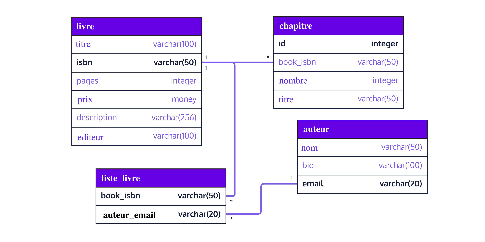
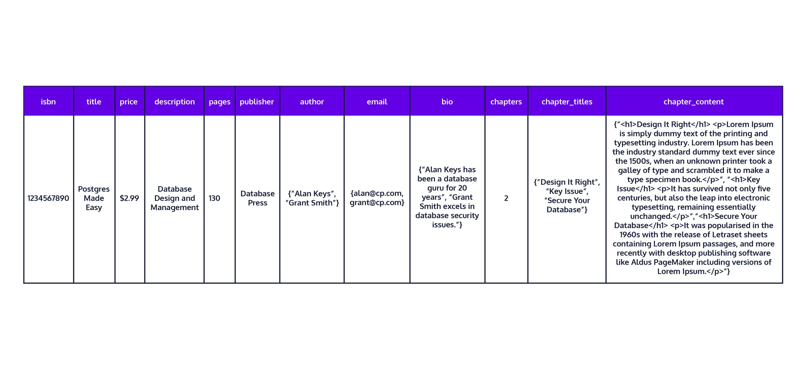
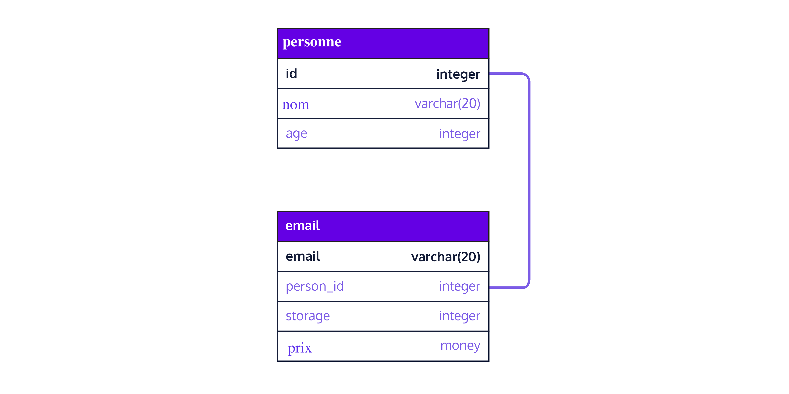
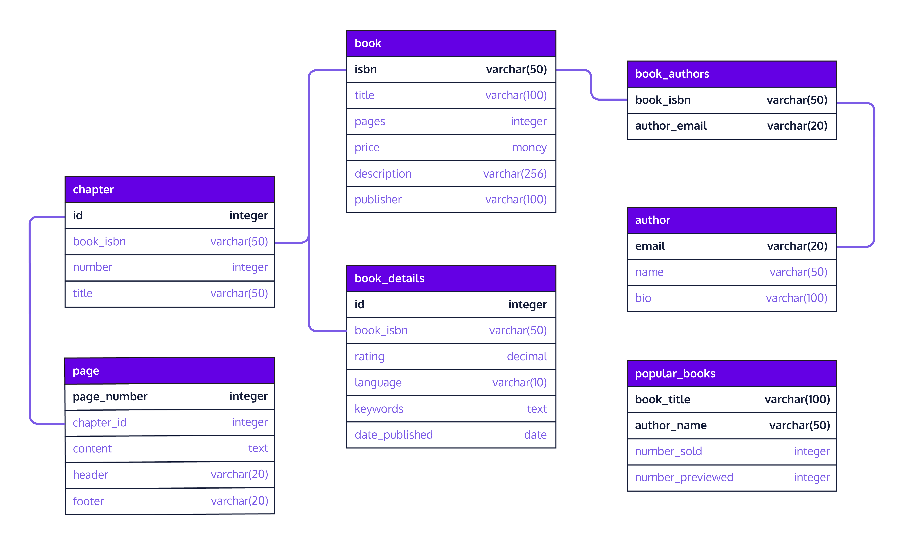
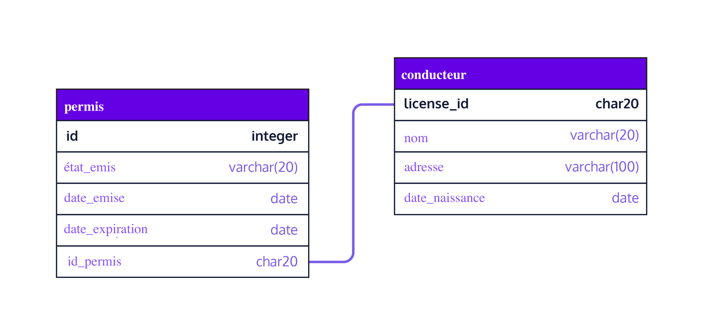
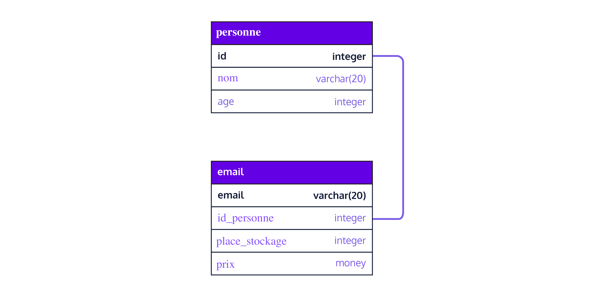

# Conception d'une base de données

## QU'EST-CE QU'UN SCHÉMA DE BASE DE DONNÉES ?

Dans cette leçon, vous allez apprendre ce qu'est un schéma de base de données et comment en créer un avec `PostgreSQL` . `PostgreSQL` est un système de gestion de base de données populaire qui stocke les informations sur un serveur de base de données dédié plutôt que sur un système de fichiers local. Les avantages de l'utilisation d'un système de base de données incluent une meilleure organisation des informations liées, un stockage plus efficace et une récupération plus rapide.

À l'instar d'un plan d'architecture, un schéma de base de données est une documentation qui aide son public, tel qu'un concepteur de base de données, un administrateur et d'autres utilisateurs, à interagir avec une base de données. Il donne une vue d'ensemble de l'objectif de la base de données, des données qui la composent, de la manière dont les données sont organisées en tables, de la structure interne des tables et de leurs relations mutuelles.

Lorsque vous concevez un schéma de base de données, tenez compte des étapes suivantes :

- Définissez l'objectif de votre base de données.
- Trouvez les informations qui composent la base de données
- Organisez vos informations en tables
- Structurez vos tables en colonnes d'information
- Évitez les données redondantes qui conduisent à l'inexactitude et au gaspillage d'espace.
- Identifiez les relations entre vos tables et mettez-les en œuvre.

Les deux derniers points garantissent l'exactitude et l'intégrité des données chaque fois que vous devez ajouter ou mettre à jour des informations dans la base de données. Ils rendent également l'interrogation de la base de données beaucoup plus efficace.

Vous pouvez concevoir des schémas de base de données à la main ou à l'aide d'un logiciel. Voici quelques exemples d'outils gratuits de conception de bases de données en ligne :

- [DbDiagram.io](https://www.dbdesigner.net/) - un outil simple et gratuit pour dessiner des diagrammes ER en écrivant simplement du code, conçu pour les développeurs et les analystes de données.
- [SQLDBM](https://sqldbm.com/home) - Modélisateur de bases de données SQL
- [DB Designer](https://dbdiagram.io/home) - outil en ligne de conception et de modélisation de schémas de bases de données


Ci-dessous, vous trouverez un exemple de diagramme de schéma de base de données généré par **DbDiagram.io**. Voyons ce que cela implique.




L'objectif de cette base de données est de maintenir un inventaire de livres. Les informations contenues dans la base de données sont organisées en quatre tables : `book`, `chapter`, `author` et `book_list`.

Quelles sont les données que nous stockons sur un livre ? A quoi sert la table book_list ?

Dans ce diagramme de schéma particulier, les symboles `1` et `*` sur les lignes indiquent une relation un-à-plusieurs entre ces tables :

- `book` et `chapter`
- `book` et `book_list`
- `author` et `book_list`

Nous examinerons les relations plus en détail dans une leçon ultérieure.

Les différents outils de base de données illustrent les relations entre les tables avec des symboles différents.

Le schéma de votre base de données doit contenir les éléments suivants

- les noms des tables
- noms des colonnes par table
- les types de colonnes par table
- les contraintes par table, le cas échéant
- les relations entre les tables, le cas échéant.

Dans cette leçon, nous nous concentrerons principalement sur les trois premiers éléments. Dans les leçons suivantes, nous aborderons les contraintes et les relations.


## Identification de vos tables

Dans cet exercice, nous allons nous plonger dans la conception de notre propre schéma de base de données. L'objectif de notre base de données est de permettre à une librairie en ligne de montrer son catalogue de livres à des acheteurs potentiels et à un acheteur de prévisualiser des échantillons de chapitres d'un livre sélectionné.

Imaginez que vous soyez en train de feuilleter un livre sur Amazon.com.

Après avoir rassemblé les informations pour cette base de données, nous avons constaté que notre base de données devrait avoir :

- des informations sur le livre, notamment le titre, l'isbn, le nombre de pages, le prix, la description et l'éditeur, pour avoir un aperçu du livre
- des informations sur l'auteur, notamment sa biographie et son contact
- des informations sur les chapitres du livre, notamment le numéro du chapitre, le titre du chapitre et le contenu du chapitre qui peut être visualisé en ligne.

Comme vous pouvez le constater, il y a beaucoup d'informations à conserver dans notre base de données. L'étape suivante consiste à organiser les informations de notre base de données en tables.

Regardez un exemple de ligne ci-dessous si nous décidons de stocker toutes nos informations dans une seule table. Pour des raisons d'espace, nous avons rendu les informations du chapitre très petites et irréalistes.




D'après les informations fournies, est-il judicieux d'organiser nos données dans un seul tableau ? Le tableau est-il facile à utiliser tel quel ? Comporte-t-il trop de colonnes couvrant différents sujets ?

Qu'est-ce qui constitue l'essentiel de ce tableau ? Vous avez raison si vous pensez qu'il s'agit du contenu du chapitre. Le contenu des chapitres est utile lorsqu'un acheteur potentiel souhaite avoir un aperçu d'un livre. 

Mais tous les livres ne mettent pas leur contenu à la disposition du public. Dans ce cas, les colonnes du contenu du chapitre seront vides. Pour faciliter l'utilisation de cette table, il est plus logique de stocker le contenu du chapitre dans sa propre table. Cela rendrait également le tableau actuel plus léger et plus facile à gérer. Par conséquent, nous devons restructurer ce tableau de manière à ce que les informations relatives aux chapitres résident dans leur propre tableau.

Il ne nous reste plus qu'une table contenant uniquement des informations sur le livre et l'auteur.

- Que faire si nous souhaitons contacter un auteur sans avoir besoin de savoir quels livres il écrit ? 
- Serait-il judicieux de consulter cette table qui relie toujours un livre à son auteur ? 
- Ou serait-il plus judicieux de conserver les informations sur l'auteur séparément ? 
- La réponse à cette dernière question est "oui".

Entraînons-nous à organiser les informations en identifiant des tableaux dans les exercices suivants.

### À vous de jouer ! 🤠

1. Dans une base de données chargez le contenu du fichier `DATABASE_books.sql`

2. Cet exercice contient un schéma mal écrit pour une base de données de profils d'étudiants. Tapez une requête pour sélectionner le contenu de la table `profile`.

Vous devriez voir des résultats similaires à ceux-ci :


Le tableau de profile contient beaucoup de colonnes. Il contient également des valeurs vides dans plusieurs colonnes de la deuxième ligne. Après avoir étudié les résultats du tableau de profile, pensez à comment pourriez-vous réorganiser les données et restructurer ce tableau ?


La table de profil contient des colonnes relatives au domicile, au travail et à l'école d'une personne. Étant donné que tous les étudiants n'occupent pas un emploi, ce qui entraîne des colonnes vides, telles que `work_position`, `work_address`, `work_phone` et `work_id`, il serait judicieux de séparer ces colonnes de la table pour en faire une table distincte. De même, une ou plusieurs colonnes relatives à la formation d'une personne peuvent également être vides. Il serait donc logique de regrouper les informations relatives à la formation dans une table distincte.

Par conséquent, il serait judicieux de diviser la table de profil en trois : `profil`, `travail` et `ecole`. Il pourrait également être judicieux de renommer le `profil` en `domicile` ou `personnel`.

## Création de vos tables

Une fois que nous avons identifié nos tables pour notre schéma, l'étape suivante consiste à déclarer ce que doivent contenir nos tables. Une table de base de données est constituée de colonnes d'informations. Un nom et un type de données sont attribués à chaque colonne. Vous pouvez voir ces informations représentées dans le diagramme de schéma de l'exercice 1.

Pour créer une table dans PostgreSQL, nous utiliserons la syntaxe SQL suivante :

```sql
CREATE TABLE personne (
  prenom varchar(15),
  nom varchar(15),
  age integer,
  …
  ssn char(9)
);
```

Dans cet exemple, le nom de la table est `personne`, et les noms de ses colonnes sont `prenom`, `nom` et `ssn`. Vous pouvez penser qu'un nom de colonne représente une propriété, un attribut ou un champ de la table. La convention de nommage que nous utilisons dans ce cours pour définir les tables PostgreSQL est la typographie [Snake case](https://fr.wikipedia.org/wiki/Snake_case), qui utilise des lettres minuscules avec des traits de soulignement entre les mots pour les noms de colonnes et de tables.

Chaque nom de colonne est associé à un type de colonne qui est un type de données tel que numérique, caractère, booléen ou autres types intéressants. Voici un résumé des types de données courants, ce qu'ils représentent, leurs valeurs types et la façon dont ils s'affichent sur Postgresql :

| Type de données  | Représentation                                                  | Valeur      | Affichage |
|------------------|-----------------------------------------------------------------|-------------|-----------|
| integer (entier) | nombre entier                                                   | 617         | 617       |
| decimal          | nombre à virgule flottante                                      | 26.17345    | 26.17345  |
| money            | nombre fixe à virgule flottante avec 2 décimales                | 6.17        | $6.17     |
| boolean          | logique                                                         | TRUE, FALSE | t, f      |
| char(n)          | la chaîne de longueur fixe supprime les blancs de fin de chaîne | ‘123 ‘      | ‘123’     |
| varchar(n)       | chaîne de longueur variable                                     | ‘123 ‘      | ‘123 ‘    |
| text             | chaîne de longueur illimitée                                    | ‘123 ‘      | ‘123 ‘    |

Commençons à créer nos tables pour notre schéma de base de données d'inventaire de livres d'un exercice précédent.


### À vous de jouer ! 🤠

1. Créez une requête pour créer la table `livre` avec les colonnes suivantes
    - `titre` pour le titre du livre, un varchar de 100 caractères
    - `isbn` pour l'isbn du livre, un varchar de 50 caractères
    - `pages` pour le nombre de pages du livre, un entier
    - `prix` pour le prix du livre, de type monétaire
    - `description` pour la description du livre, un varchar de 256 caractères
    - `editeur` pour le nom de l'éditeur du livre, un varchar de 100 caractères.


2. Créez une autre table, chapitre, avec les colonnes suivantes :

    - id pour l'identifiant unique du `chapitre`, de type entier
    - `numero` pour le numéro de chapitre, de type integer
    - `titre` pour le titre du chapitre avec varchar de 50 caractères
    - `contenu` pour le contenu du chapitre avec varchar de 1024 caractères.
    - `livre_isbn` pour l'isbn du livre avec varchar de 50 caractères
   


3. De même, créez la table, `auteur` avec ces colonnes :

    - `nom` pour le nom de l'auteur, en varchar de 50 caractères
    - `bio` pour la bio de l'auteur, en varchar de 100 caractères
    - `email` pour l'email de l'auteur, en varchar de 20 caractères
    - `livre_isbn` pour l'isbn du livre avec varchar de 50 caractères


## Interroger vos tables

Maintenant que nous avons défini nos trois tables, livre, chapitre et auteur, alimentons nos tables avec des exemples de données et effectuons des requêtes.

Pour insérer des données dans une table `PostgreSQL`, utilisez cette syntaxe :

```sql
INSERT INTO nom_table VALUES (
  valeur_colonne_une,
  valeur_colonne_deux,
  …
  valeur_colonne_N
);
```

Pour interroger une table et obtenir toutes les colonnes, tapez :

```sql
SELECT * from nom_table ;
```

Afin de disposer d'un schéma utile, nous devons empêcher une table de base de données de stocker des données inexactes et de renvoyer plusieurs lignes alors que nous n'en attendons qu'une seule. Pour ce faire, nous imposons des contraintes à la table à l'aide d'une **clé primaire** affectée à une ou plusieurs colonnes.

Cela garantit que la colonne ou la combinaison de colonnes ne contient que des valeurs uniques. Nous explorerons ce sujet plus en détail dans une prochaine leçon sur les clés.

### À vous de jouer !

1. Insérer cette requête d'insertion pour alimenter notre base de données.
```sql
INSERT INTO livre (titre, isbn, pages, prix, description, editeur)
VALUES ('L''Economie bleue 3.0','979-1032906125',480, 24.0, 'il est possible de révolutionner notre consommation et nos moyens de production tout en protégeant la nature.','L''OBSERVATOIRE');
```


2. Nous avons créé la table `livre` et l'avons alimentée avec des données échantillons. Pouvez-vous ajouter une autre ligne à la table ?

    Remplissez la table livre avec les données suivantes :

    - titre, 'Pensées pour moi-même' 
    - isbn, '979-1032906125' 
    - pages, 222
    - prix, 3,90
    - description, "Réflexions stoïciennes rédigées par l'empereur Marc Aurèle".
    - éditeur, "FLAMMARION".


Ensuite, ajoutez une requête à la table des livres pour valider toutes les données que vous avez saisies en fonction du titre du livre.

3. Interrogez la table des livres pour le isbn '979-1032906125'.

Avez-vous remarqué que deux livres sont renvoyés sur la base de la même valeur isbn ? Réfléchir à comment résoudre ce problème pour qu'une seule ligne unique soit renvoyée par valeur isbn ?


> Pour éviter que la table des livres ne stocke des données inexactes et ne renvoie plusieurs lignes alors que nous n'en attendons qu'une sur la base de son isbn, nous devons nous assurer que la colonne isbn ne contient que des valeurs uniques. Pour ce faire, nous imposons des contraintes à la table à l'aide de clés primaires, un sujet que nous explorerons dans une prochaine leçon sur les clés.


## Relations entre les tables 


Vous vous souvenez peut-être du diagramme ci-dessus, dans lequel les tables de la base de données sont reliées par des lignes. Les lignes reliant les tables décrivent les relations entre elles. Par exemple, la table des livres est liée à deux autres tables - la table des chapitres et la table des listes de livres, via des colonnes liées - isbn et book_isbn.

Supposons que nous ayons une table de personnes et une table d'adresses électroniques, où une personne peut avoir plusieurs adresses électroniques, mais une adresse électronique ne peut appartenir qu'à une seule personne. Pour mettre en œuvre ce type de relation, nous devons appliquer une contrainte sur la table email en lui ajoutant une autre colonne et en la désignant comme associée à la table personne.

Supposons que nous ayons également une table hobby et que nous la remplissions avec toutes sortes de hobbies. Si nous essayons d'interroger à la fois les tables hobby et personne, comment pouvons-nous être sûrs qu'un hobby est lié à une personne particulière ? Il n'y a rien dans la table person qui la lie à un hobby.

Pour associer un hobby à une personne, nous devons relier la table person à la table hobby avec le type de relation qu'elles ont. Une personne peut-elle avoir un seul hobby ou plusieurs hobbies ? Un hobby peut-il s'appliquer à une seule personne ou peut-il être partagé par plusieurs personnes ?

Nous aborderons ces relations intéressantes entre les tables et la manière de les mettre en œuvre dans les prochaines leçons sur les clés et les relations. Jusqu'à présent, les tables que vous avez créées sont des tables autonomes qui n'ont aucun lien entre elles. Voyons si nous pouvons relier les tables de ce schéma dans les exercices suivants.


### À vous de jouer ! 🤠

1. Remplissons la table des chapitres avec des données types.
```sql
INSERT INTO chapitre (id, numero, titre, contenu) VALUES
(1, 1, '1. Passer d''une espèce aux écosystème', '
L''écologie et le développement durable sont des notions qui ont fait éclore la conscience d''une « pen-sée verte ». Ces idées à présent très répandues nous ont appris à apprécier et privilégier l''utilisation de matières écologiquement responsables. Cependant, même si nous commençons à mieux comprendre l''importance d''un cycle de production éthique, nous avons encore du mal à le rendre économiquement viable.'),
(2, 2, 'La puissance du pragmatisme', 'Le déferlement de mauvaises nouvelles sur l''environnement, la pauvreté, le chômage, les violations des droits de l''Homme, l''inaction et la corruption de décideurs, ajouté à l''attitude passive (business as usual) des entreprises, laisse de plus en plus de citoyens soucieux, mais terriblement dépités. '),
(3, 3, 'Inspirante Nature', 'Pour qu''une société perdure, il faut une économie dynamique et adaptative. Mais l''inverse est tout aussi vrai. ');

```


2. Écrivez une requête sur la table des chapitres pour afficher son contenu actuel.

    <details>
        <summary>Plus d'explications. ⬇️</summary>
        <p>Un livre comporte généralement plusieurs chapitres, mais un chapitre ne peut appartenir qu'à un seul livre. Pour mettre en œuvre ce type de relation, nous devons appliquer une contrainte sur la table des chapitres en lui ajoutant une autre colonne et en la désignant comme associée à la table des livres.Nous discuterons de cette relation particulière entre les tables et de la manière de la mettre en œuvre dans les prochaines leçons sur les clés et les relations.</p>
    </details> 

    Réfléchissez à la façon dont cette table peut être liée à la table des livres. Comment pouvons-nous associer le contenu du chapitre à un livre particulier ?


3. Remplissons la table des auteurs avec des données types 
```sql
INSERT INTO auteur (nom, bio, email) VALUES
('Gunter ¨Pauli', 'Industriel belge menant différents projets autour de l''écologie et du developpement durable ', 'gunter@gmail.com'),
('Marc Aurèle', 'Empereur, philosophe stoïcien et écrivain romain', '');
```

4.Nous avons rempli la table des auteurs avec des données types.

- Écrivez une requête sur la table des auteurs pour voir son contenu
- Ajoutez une autre requête pour tout sélectionner dans la table des livres.
- Étudiez les colonnes de la table des livres. Comment savoir quel livre a été écrit par un auteur particulier ? 
    
    Quelles colonnes de la table livre et auteur seraient utiles pour associer un livre à un auteur et vice versa ?

    <details>
        <summary>Plus d'explications. ⬇️</summary>
        <p>Un livre comporte généralement plusieurs chapitres, mais un chapitre ne peut appartenir qu'à un seul livre. Pour mettre en œuvre ce type de relation, nous devons appliquer une contrainte sur la table des chapitres en lui ajoutant une autre colonne et en la désignant comme associée à la table des livres.</p>
    </details> 

## QUE SONT LES CLÉS D'UNE BASE DE DONNÉES ?

Un schéma de base de données donne une vue d'ensemble de l'objectif de la base de données ainsi que des données qui la composent, de la façon dont les données sont organisées en tables, de la structure interne des tables et des relations entre elles.

Supposons que nous ayons réussi à créer un schéma de base de données pour un inventaire de livres avec trois tables autonomes - `livre`, `chapitre` et `auteur`. Voir l'image dans le volet de droite.

La table `livre` comporte les colonnes suivantes

- `titre` pour le titre du livre, un varchar de 100 caractères

- `isbn` pour l'isbn du livre, un varchar de 50 caractères

- `pages` pour le nombre de pages du livre, un entier

- `prix` pour le prix du livre, un type d'argent

- `description` pour la description du livre, un varchar de 256 caractères

- `editeur` pour le nom de l'éditeur du livre, un varchar de 100 caractères.


La table `chapitre` contient les colonnes suivantes

- `id` pour l'identifiant unique du chapitre, un entier

- `numero` pour le numéro de chapitre, un entier

- `titre` pour le titre du chapitre, un varchar de 50 caractères

- `contenu` pour le contenu du chapitre, un varchar de 1024 caractères.

La table `auteur` a ces colonnes :

- `nom` pour le nom de l'auteur, un varchar de 50 caractères
- `bio` pour la bio de l'auteur, un varchar de 100 caractères
- `email` pour l'email de l'auteur, un varchar de 20 caractères.


Comme nos tables de base de données ne sont pas encore reliées les unes aux autres, le schéma de notre livre n'est pas complet tant que nous ne l'avons pas affiné en lui fournissant une structure supplémentaire. Dans cette leçon, nous allons apprendre à désigner certaines colonnes d'une table de base de données comme clés.

Qu'est-ce qu'une **clé** ?
>Une clé de base de données est une colonne ou un groupe de colonnes d'une table qui identifie de manière unique une ligne de la table.

Pourquoi avons-nous besoin de clés ? Les clés permettent au concepteur d'une base de données d'**imposer des contraintes aux données d'une table**. Nous voulons appliquer l'intégrité des données dans nos tables afin d'**éviter la duplication des informations** et de **maintenir strictement les relations entre les tables**. Par exemple, une clé primaire garantit que chaque ligne d'une table est unique.

Il existe de nombreux types de clés : Super, Candidate, Primaire, Etrangère, Composite et Secondaire. Dans ce cours, nous nous concentrerons sur les clés primaires, étrangères et composites, car ce sont les plus couramment utilisées. Nous allons en apprendre davantage sur certaines de ces clés dans l'exercice suivant.


## Clé primaire

Une **clé primaire** est une désignation qui s'applique à une colonne ou à plusieurs colonnes d'une table et qui **identifie de manière unique chaque ligne de la table**. Par exemple, le numéro de sécurité sociale d'un employé peut servir de clé primaire dans une table d'employés contenant des lignes de données sur les employés.

La désignation d'une clé primaire sur une colonne particulière d'une table garantit que les données de cette colonne sont toujours uniques et non nulles. Par exemple, il peut y avoir plusieurs recettes du même nom, chacune avec son propre identifiant, mais deux recettes ne doivent pas partager le même identifiant.

Pour désigner une clé primaire dans une table, tapez le mot clé `PRIMARY KEY` en majuscules à côté de la colonne sélectionnée lors de la création d'une table. Par exemple, le code suivant désigne la colonne `id` comme clé primaire pour la table des recettes.

```sql
CREATE TABLE recette (
  id integer PRIMARY KEY,
  nom varchar(20),
  ...
);
```

### À vous de jouer ! 🤠

1. Étudiez l'instruction `CREATE TABLE` pour la table des livres. Quelle colonne de la table livre désigneriez-vous comme clé primaire ?
    ```sql
    CREATE TABLE livre (
      titre varchar(100),
      isbn varchar(50),
      pages integer,
      prix money,
      description varchar(256),
      editeur varchar(100)
    );
    ```
   Supprimer  la table `livre` avec  la commande `DROP TABLE` et refaite une `CREATE TABLE` pour désigner la bonne colonne comme clé primaire.
    
    


2. Étudiez l'instruction `CREATE TABLE` pour la table `chapitre`. Réfléchissez un instant à la colonne de cette table qui ferait une clé primaire idéale.
    ```sql
    CREATE TABLE chapitre (
      id integer,
      numero integer,
      titre varchar(50),
      contenu varchar(1024)
    );
    ```
    Supprimer  la table `chapitre` avec  la commande `DROP TABLE` et refaite une `CREATE TABLE` pour désigner la bonne colonne comme clé primaire.
    


3. Étudiez l'instruction `CREATE TABLE` pour la table `auteur`. Réfléchissez un instant à la colonne de cette table qui ferait une clé primaire idéale.
    ```sql
        CREATE TABLE auteur (
          nom varchar(50),
          bio varchar(100),
          email varchar(20)
        );
    ```
    Supprimez la table `auteur` avec  la commande `DROP TABLE` et refaite une `CREATE TABLE` pour désigner la bonne colonne comme clé primaire.


## Validation des clés

Dans cette leçon, vous apprendrez à valider les clés que vous avez désignées pour une ou plusieurs colonnes spécifiques dans une table de base de données. Il existe plusieurs façons de le faire, mais nous allons nous concentrer sur l'utilisation de la base de données des schémas d'information fournie avec PostgreSQL.

## Schéma d'information

Faisant partie d'un standard SQL international, le [schéma d'information](https://www.postgresql.org/docs/9.1/information-schema.html) est une base de données contenant des méta-informations sur les objets de la base de données, y compris les tables, les colonnes et les contraintes. Ce schéma fournit aux utilisateurs des vues en lecture seule de nombreux sujets d'intérêt.

Par exemple, pour déterminer si une colonne a été correctement désignée comme clé primaire, nous pouvons interroger une vue spéciale, `key_column_usage`, générée à partir de cette base de données. Cette vue identifie toutes les colonnes de la base de données actuelle qui sont restreintes par une contrainte telle qu'une clé primaire ou une clé étrangère.

Supposons que vous souhaitiez connaître les contraintes qui ont été placées sur certaines colonnes dans une table, telle que `recette`, vous devez taper la requête suivante.

```sql
SELECT
  constraint_name, table_name, column_name
FROM
  information_schema.key_column_usage
WHERE
  table_name = 'recette';
```

Ceci devrait afficher le résultat suivant :

```
 constraint_name | table_name | column_name 
-----------------+------------+-------------
 recette_pkey    | recette    | id
(1 row)

```

La valeur de `constraint_name`, telle que `recette_pkey`, est générée par défaut pour commencer par un nom de table suivi du type de contrainte. `pkey` fait référence à une contrainte de clé primaire, tandis que `fkey` fait référence à une contrainte de clé étrangère.

### À vous de jouer ! 🤠

1. Nous avons recréé les tables `livre`, `chapitre` et `auteur` avec leurs clés primaires correspondantes que vous avez précédemment définies dans le dernier exercice.

    Écrivez une requête utilisant la vue `information_schema.key_column_usage` pour valider l'existence d'une clé primaire dans la table `livre`.
    Quel est le nom de la colonne qui est la clé primaire ?
    
2. Interrogez la vue `information_schema.key_column_usage` pour valider l'existence d'une clé primaire dans la table `chapitre`.
    Quel est le nom de la colonne qui possède la clé primaire ?
    
3. Interrogez la vue `information_schema.key_column_usage` pour valider l'existence d'une clé primaire dans la table `auteur`.
    Quel est le nom de la colonne qui possède la clé primaire ?
    
 


 ## Clé primaire composite

Parfois, aucune des colonnes d'une table ne peut identifier un enregistrement de manière unique. Dans ce cas, nous pouvons désigner plusieurs colonnes dans une table pour servir de clé primaire, également appelée clé primaire composite. Par exemple, nous avons une table, `livres_populaires`, qui contient les livres les plus populaires présentés en avant-première et/ou vendus au cours d'une semaine particulière.

`livres_populaires` aura ces colonnes :

- `titre_du_livre`
- `nom_auteur`
- `nombre_vendu`
- `nombre_prévus`

Étant donné qu'un auteur peut avoir plusieurs livres et qu'un livre peut avoir plusieurs auteurs, il peut y avoir plusieurs listes d'un livre ou d'un auteur particulier dans la table.

Par exemple, une liste de `livres_populaires` triés par titre de livre peut donner les résultats suivants :

```
    titre_du_livre    | nom_auteur        | nombre_vendu |   nombre_prévus 
------------------------+-----------------+--------------+----------------
 Postgres Made Easy   | Liz Key           |          33  |               50
 Postgres Made Easy   | Tom Index         |          33  |               50
 Beginner Postgres    | Tom Index         |          55  |               75
 Postgres for Dummies | Liz Key           |          25  |               33
```

Dans l'exemple ci-dessus, le titre du livre `Postgres Made Easy` est listé deux fois car il a deux auteurs. Si nous listons les livres populaires par nom d'auteur, nous pouvons trouver un auteur apparaissant deux fois, comme dans l'exemple suivant :

```sql
nom_auteur   |   titre_du_livre      
-------------+----------------------
 Liz Key     | Postgres Made Easy
 Liz Key     | Postgres for Dummies
 Tom Index   | Postgres Made Easy
 Tom Index   | Beginner Postgres
 
```

Comme nous le voyons ci-dessus, ni `titre_du_livre` ni `nom_auteur` ne peuvent être une colonne unique. Une clé primaire composite, cependant, peut être dérivée de la combinaison de `titre_du_livre` et `nom_auteur` qui rendrait une ligne unique.

Pour désigner plusieurs colonnes comme une clé primaire composite, utilisez cette syntaxe :

```sql
PRIMARY KEY (colonne_1, colonne_2)
```

Par exemple, si nous devions désigner à la fois recette_id et ingredient_id comme clé primaire composite pour la table `recettes_populaires`, nous écririons l'instruction `CREATE TABLE` pour `recettes_populaires` comme suit:

```sql
CREATE TABLE recettes_populaires (
  recette_id varchar(20),
  ingredient_id varchar(20),
  nombre_telechargements integer,
  PRIMARY KEY (recette_id, ingredient_id)
);
```

### À vous de jouer ! 🤠

1. Créez une nouvelle table `livres_populaires` avec les colonnes suivantes :

- `titre_du_livre`, un varchar de 100 caractères
- `nom_auteur`, un varchar de 50 caractères
- `nombre_vendu`, un nombre entier
- `nombre_prévus`, un nombre entier

    et désignez `titre_du_livre` et `nom_auteur` comme clé primaire composite.

2. Rédigez une requête sous l'instruction `CREATE` en utilisant la vue `information_schema.key_column_usage` pour valider l'existence de la clé primaire composite dans `livres_populaires`.

    Quels sont les noms des colonnes qui composent la clé primaire composite ?
    

## Clé étrangère Partie 1

Lorsqu'une table est liée à une autre table dans une base de données, nous pouvons souhaiter relier ces tables dans une requête. Par exemple, disons que nous avons une table `personne` et une table `email`. Si nous voulons obtenir une liste de noms et d'e-mails associés, nous devons relier ces tables.

Pour maintenir l'intégrité des données et s'assurer que nous pouvons joindre les tables ensemble correctement, nous pouvons utiliser un autre type de clé appelé clé étrangère. Une clé étrangère est une clé qui fait référence à une colonne d'une autre table.

Où devons-nous placer cette clé étrangère ? Doit-elle être dans la table  `personne` ou dans la table  `email` ? Pour répondre à cette question, nous devons déterminer comment la personne est liée à l'email. La création d'un enregistrement de personne nécessite-t-elle l'existence d'un enregistrement d'e-mail ? 

Ce n'est généralement pas le cas. Une personne peut ne pas avoir d'adresse électronique ou avoir une ou plusieurs adresses électroniques. Ainsi, lorsque nous créons un enregistrement dans la table des personnes, nous n'insistons pas pour que cette personne ait également un enregistrement dans la table des adresses électroniques.

La création d'un enregistrement de courrier électronique nécessite-t-elle l'existence d'un enregistrement de personne valide ? 

C'est généralement le cas, car nous ne devons pas créer une adresse électronique pour une personne inexistante. Par conséquent, nous devons placer la clé étrangère dans la table des emails pour nous assurer qu'un enregistrement valide dans la table des personnes doit préexister avant d'ajouter un enregistrement dans la table des emails.

Dans l'illustration ci-dessous, la clé étrangère est `id_personne` dans la table `email`.



Pour désigner une clé étrangère sur une seule colonne dans `PostgreSQL`, nous utilisons le mot-clé `REFERENCES` :

```sql
CREATE TABLE personne (
  id integer PRIMARY KEY,
  nom varchar(20),
  age integer
);
 
CREATE TABLE email (
  email varchar(20) PRIMARY KEY,
  id_personne integer REFERENCES person(id),
  stockage integer,
  prix money
);
```

### À vous de jouer ! 🤠


Jetez un coup d'œil au schéma du livre que vous avez créé précédemment.


1. Pouvez-vous deviner comment un livre peut être lié à ses chapitres ? Si vous deviez dire qu'un livre a plusieurs chapitres, vous auriez raison.
  
  -  Supprimer  la table `chapitre` avec  la commande `DROP TABLE` et refaite une `CREATE TABLE` avec une colonne `isbn_livre` dans la table `chapitre` dont le type de données est le même que la colonne `isbn` dans `livre`.
  
  - Ensuite, désignez cette colonne comme étant une **clé étrangère**.
    
    
2. Interrogez la vue `information_schema.key_column_usage` pour valider que vous avez désigné `isbn_livre` comme clé étrangère dans la table `chapitre`.


##  Clé étrangère Partie 2

Maintenant que vous avez relié deux tables par le biais d'une clé étrangère, vous vous êtes assuré que vous pouvez correctement réunir les tables dans une requête.

Par exemple, supposons que nous voulions réunir les tables `personne` et `email` du schéma suivant :


Nous pourrions utiliser la requête suivante pour retourner un tableau de noms et d'emails associés :

```sql
SELECT personne.nom AS nom, email.email AS email
FROM personne, email
WHERE personne.id = email.id_personne;
```

### À vous de jouer ! 🤠

0. Supprimons de nouveau les 2 tables `chapitre` et `livre`.
```sql
DROP TABLE livre;
DROP TABLE chapitre;
```
1. Remplissons la base de données avec des données de livres types.
```sql
    CREATE TABLE livre (
      titre varchar(100),
      isbn varchar(100)  PRIMARY KEY,
      pages integer,
      prix money,
      description varchar(1024),
      editeur varchar(100)
    );

    CREATE TABLE chapitre (
      id integer PRIMARY KEY,
      isbn_livre varchar(100) REFERENCES livre(isbn),
      numero integer,
      titre varchar(100),
      contenu varchar(1024)
    );
    
    INSERT INTO livre (titre, isbn, pages, prix, description, editeur)
    VALUES ('L''Economie bleue 3.0','979-1032906125',480, 24.0, 'il est possible de révolutionner notre consommation et nos moyens de production tout en protégeant la nature.','L''OBSERVATOIRE'),
    ('Pensées pour moi-même', '978-2080700162', 222, 3.90, '«On sent en soi-même un plaisir secret lorsqu''on parle de cet empereur ; on ne peut lire sa vie sans une espèce d''attendrissement ; tel est l''effet qu''elle produit qu''on a meilleure opinion de soi-même, parce qu''on a meilleure opinion des hommes.» Montesquieu', 'FLAMMARION');
    
    INSERT INTO chapitre (id, isbn_livre, numero, titre, contenu) VALUES
    (1,'979-1032906125', 1, '1. Passer d''une espèce aux écosystème', '
    L''écologie et le développement durable sont des notions qui ont fait éclore la conscience d''une « pen-sée verte ». Ces idées à présent très répandues nous ont appris à apprécier et privilégier l''utilisation de matières écologiquement responsables. Cependant, même si nous commençons à mieux comprendre l''importance d''un cycle de production éthique, nous avons encore du mal à le rendre économiquement viable.'),
    (2,'979-1032906125', 2, 'La puissance du pragmatisme', 'Le déferlement de mauvaises nouvelles sur l''environnement, la pauvreté, le chômage, les violations des droits de l''Homme, l''inaction et la corruption de décideurs, ajouté à l''attitude passive (business as usual) des entreprises, laisse de plus en plus de citoyens soucieux, mais terriblement dépités. '),
    (3,'979-1032906125', 3, 'Inspirante Nature', 'Pour qu''une société perdure, il faut une économie dynamique et adaptative. Mais l''inverse est tout aussi vrai. '),
    (4, '978-2080700162', 1, 'Livre 1', 'De mon grand père Vérus: la bonté coutumière, le calme inaltérable.'),
    (5, '978-2080700162', 5, 'Livre 5', 'Au petit jour, lorsqu''il t''en coûte de t''éveiller aie cette pensée à ta disposition');
```


2. Écrivez une requête pour afficher tout ce qui se trouve dans la table des livres.


3. Nous avons également rempli la table des chapitres. Écrivez une requête pour afficher tout ce qui se trouve dans la table des chapitres.


4. Écrivez une requête pour afficher livre.titre comme livre et chapitre.titre comme chapitres à partir des tables livre et chapitre.

    Chaque ligne renvoyée doit afficher les noms des chapitres et le nom du livre dans lequel ils se trouvent.
    

## QUE SONT LES RELATIONS DANS UNE BASE DE DONNÉES ?

Dans cette leçon, nous allons découvrir les relations entre les tables et comment utiliser ces connaissances pour améliorer notre base de données. Cette leçon s'appuie sur les connaissances préalables des clés de base de données acquises dans la leçon sur les clés de base de données.

Vous trouverez ci-dessous un exemple de diagramme de schéma de base de données. Voyons ce qu'il contient. Il y a sept tables dans ce diagramme et la plupart d'entre elles sont liées les unes aux autres, à l'exception d'une table autonome, `livres_populaires`. Dans chaque table, les clés primaires sont en gras. Les lignes entre les tables relient les clés étrangères et les clés primaires.

Que sont les relations ? Une relation de base de données établit la manière dont les tables connectées dépendent les unes des autres.

Quels sont les différents types de relations dans une base de données ? Il en existe trois types : `une à une`, `une à plusieurs` et `plusieurs à plusieurs`.

Nous les étudierons en détail dans les exercices suivants. Commençons.




## Relation une à une

Dans une **relation une à une**, **une ligne de la table A est associée à exactement une ligne de la table B** et vice-versa.

Par exemple, une personne ne peut se voir attribuer qu'un seul passeport. Inversement, un passeport ne peut être délivré qu'à une seule personne. Une voiture ne peut se voir attribuer qu'un seul numéro d'identification de véhicule et vice-versa. Un conducteur ne peut se voir délivrer qu'un seul permis de conduire dans son État d'origine.

Développons davantage ce dernier exemple. Supposons que nous ayons une table `conducteur` avec les colonnes suivantes :

- `nom`
- `adresse`
- `date_de_naissance`
- `numéro de permis`


Nous avons également une table `permis` avec les colonnes suivantes :

- `id`
- `état_emis`
- `date_emise`
- `date_expiration`

Dans la table des conducteurs, la clé primaire qui identifie de manière unique un conducteur est le numéro de permis. De même, la clé primaire qui identifie de façon unique un permis de conduire dans la table des permis est l'id lui-même. Pour établir une relation biunivoque dans PostgreSQL entre ces deux tables, nous devons désigner une clé étrangère dans l'une des tables. Nous pouvons choisir l'id_licence du conducteur pour être la clé étrangère dans la table licence. Cependant, cela n'est pas suffisant pour garantir que les lignes dupliquées n'existeront pas dans la table des licences.

Pour renforcer une relation strictement une-à-une dans PostgreSQL, nous avons besoin d'un autre mot-clé, `UNIQUE`. En ajoutant ce mot-clé à la déclaration de la clé étrangère, nous devrions être prêts.

```sql
id_permis char(20) REFERENCES
conducteur(id_permis) UNIQUE
```





Le script PostgreSQL complet pour créer ces deux tables est le suivant :


```sql
CREATE TABLE conducteur (
    id_permis char(20) PRIMARY KEY,
    nom varchar(20),
    adresse varchar(100),
    date_naissance date
);      
 
CREATE TABLE permis (
    id integer PRIMARY KEY,
    état_emis varchar(20),
    date_emise date,
    date_expiration  date,
    id_permis char(20) REFERENCES conducteur(id_permis) UNIQUE
); 
```

### À vous de jouer ! 🤠


Jetons un coup d'œil à la table  livre. Les colonnes actuelles de notre table de livres sont les suivantes

- titre
- isbn de varchar(50)
- pages
- prix
- description
- editeur

Supposons que nous souhaitions conserver des informations facultatives supplémentaires telles que la cote du livre, la langue dans laquelle il a été écrit, une liste de mots-clés pour étiqueter le livre et la date de publication. Ces informations étant facultatives, il n'est pas nécessaire de les inclure dans la table des livres. Si nous le faisons, nous risquons de nous retrouver avec un grand nombre de colonnes vides pour certains livres. Au lieu de cela, nous pouvons créer un nouveau tableau pour les contenir. Nous pouvons ensuite établir une relation univoque entre ces deux tables.


1. Créons une nouvelle table, `details_livre`, avec les colonnes suivantes

- `id` du même type que `isbn` dans le livre
- `cote` de type décimal
- `langue` de type varchar(10)
- `mots_cles` de type text[], un tableau de chaînes de longueur illimitée
- `date_publication` de type date


2. Désignez une clé primaire pour `details_livre`.
	- Désignez une clé étrangère, `livre_isbn`, qui renvoie à la colonne isbn du livre. Ajoutez cette clé sous la colonne id. Renforcez la relation univoque entre ces deux tables à l'aide d'un autre mot-clé.


3.  Validez l'existence des contraintes de clé que vous avez ajoutées pour `details_livre`. en utilisant la vue `information_schema.key_column_usage`.
	- Tapez votre requête pour retourner les colonnes


4. Étudiez les instructions`INSERT`:
	```sql
	INSERT INTO details_livre VALUES (
	  1,
	  '979-1032906125',
	  6,
	  'Français',
	  '{économie, écologie}',
	  '2019-05-29'
	);

	INSERT INTO details_livre VALUES (
	  2,
	  '979-1032906125',
	  8,
	  'Français',
	  '{philosophie, stoicisme}',
	  '1999-01-04'
	);
	```

	 La première  instruction INSERT ajoute la première ligne à la table `details_livre`. La seconde instruction INSERT tente d'ajouter une autre ligne à la table `details_livre` avec la même valeur `livre_isbn` que la ligne précédente.

    - Copiez et collez le contenu de ce code  et cliquez sur RUN. 

	- Examinez ensuite le message d'erreur renvoyé. Vous devez vous attendre à voir le message d'erreur suivant

	```
	ERROR:  duplicate key value violates unique constraint "details_livre_livre_isbn_key"
	DETAIL:  Key (livre_isbn)=(979-1032906125) already exists.
	SQL state: 23505
	```
	- Corriger le second code isbn de la seconde requête INSERT en `978-2080700162`


5. Écrivez une requête pour afficher les données suivantes :

    - livre.titre
    - livre.prix
    - details_livre.langue
    - details_livre.cote

Il s'agit essentiellement d'afficher les données communes disponibles dans `livre` et `details_livre` sur la base de leur identifiant commun, livre.isbn et details_livre.livre_isbn.

La requête doit retourner une ligne de résultat pour le livre dont le titre est `Pensées pour moi-même`.


## Relation de type une à plusieurs

Contrairement à la **relation une à une**, la relation **une à plusieurs** ne peut pas être représentée dans une seule table. Pourquoi ? Parce que plusieurs lignes doivent exister pour une clé primaire, ce qui entraîne une redondance des données et brise la contrainte imposée à la clé primaire.

Prenons l'exemple d'une table dans laquelle nous voulons qu'une personne puisse avoir plusieurs adresses électroniques. Cependant, s'il existe une clé primaire dans la table, telle que `id`, les lignes suivantes seront rejetées par la base de données.

```

nom   id (PK)     email       
Cody   2531       cody@yahoo.com 
Cody   2531       cody@google.com
Cody   2531       cody@bing.com
```

Pour résoudre ce problème, nous devons représenter une relation `une-à-plusieurs` avec deux tables - une table parent et une table enfant. Comme dans le cas d'une relation parent-enfant où un parent peut avoir plusieurs enfants, la table parent contient une clé primaire et la table enfant contient des clés primaires et étrangères. La clé étrangère lie la table enfant à la table parent.

L'illustration suivante montre la relation "relation une à une" entre les tables `personne` et `email`.



### À vous de jouer !

Étudions le schéma de notre livre et voyons comment nous pourrions l'améliorer encore pour fournir un autre exemple de relation `une-à-plusieurs`.


Dans la leçon sur les clés de base de données, nous avons identifié un livre et un chapitre comme ayant une relation de type `une à plusieurs`, car un livre peut avoir plusieurs chapitres. Nous avons donc déjà lié la table `chapitre` à la table `livre` via une clé étrangère.

Dans cet exercice, nous allons créer une nouvelle relation de type `une à plusieurs`. Considérons la relation entre la table `chapitre` et une nouvelle table `page`. Logiquement, un chapitre de livre se compose d'une ou plusieurs pages, mais chaque page ne peut appartenir qu'à un seul chapitre. Cela correspond bien à une relation de type "une vers plusieurs". Au lieu de stocker l'intégralité du contenu du chapitre, actuellement limité à 1024 caractères, nous pouvons diviser la table `chapitre` en deux tables - `chapitre` et `page`, où `chapitre` a une relation `une-à-plusieurs` avec `page`.

1. Créez une nouvelle table, `page`, avec les colonnes suivantes :

- `id` pour l'id de la page de type integer qui est aussi une clé primaire
- `contenu` pour le contenu de la page de type texte de caractère illimité
- `entete` pour l'en-tête de la page de type varchar(20)
- `pied` pour le pied de page de type varchar(20)

    Ajoutez une clé étrangère, `id_chapitre`, qui fait référence à la table `chapitre` et à sa colonne `id`, de type integer, à cette table, sous la colonne `id`.


2. Puisque nous avons déplacé la colonne de contenu dans une nouvelle table, `page`, nous n'avons pas besoin de cette colonne dans `chapitre`. Supprimez la colonne de contenu du `chapitre`. Utilisez la requête suivante:
```sql
ALTER TABLE chapitre
DROP COLUMN contenu;
```


3. Écrivez une requête pour valider l'existence des contraintes clés que vous venez d'ajouter à `page` en interrogeant la vue `information_schema.key_column_usage` et en renvoyant les colonnes suivantes : `constraint_name`, `table_name`, et `column_name`.

    Vous devriez voir deux lignes qui décrivent les noms des colonnes qui contiennent les clés primaires et étrangères.


4. Nous aimerions remplir les tables `livre`, `chapitre` et `page` avec des données types.
    Étudiez les différentes instructions `INSERT`. Les trois premières instructions `INSERT`  créent une instance de 3 chapitres, un chapitre par livre. Les deux instructions `INSERT` suivantes créent une instance de 2 pages, deux pages par livre. Copiez le contenu de ce fichier.
    ```sql
    INSERT INTO page VALUES (
      1,
      1,
      'L''écologie et le développement durable sont des notions qui ont fait éclore la conscience d''une « pen-sée verte ». Ces idées à présent très répandues nous ont appris à apprécier et privilégier l''utilisation de matières écologiquement responsables. Cependant, même si nous commençons à mieux comprendre l''importance d''un cycle de production éthique, nous avons encore du mal à le rendre économiquement viable.'
    );

    INSERT INTO page VALUES (
      2,
      2,
      'Le déferlement de mauvaises nouvelles sur l''environnement, la pauvreté, le chômage, les violations des droits de l''Homme, l''inaction et la corruption de décideurs, ajouté à l''attitude passive (business as usual) des entreprises, laisse de plus en plus de citoyens soucieux, mais terriblement dépités. '
    );

    INSERT INTO page VALUES (
      3,
      3,
      'Pour qu''une société perdure, il faut une économie dynamique et adaptative. Mais l''inverse est tout aussi vrai. '
    );

    INSERT INTO page VALUES (
      4,
      4,
      'De mon grand père Vérus: la bonté coutumière, le calme inaltérable.'
    );

    INSERT INTO page VALUES (
      5,
      5,
      'Au petit jour, lorsqu''il t''en coûte de t''éveiller aie cette pensée à ta disposition'
    );
    ```

    Collez le contenu dans votre editeur dans `pgadmin4`.
    
    
5. Écrivez une requête `INNER JOIN` connectant les tables `livre`, `chapitre` et `page` et affichez les résultats sous les noms `titre_livre`, `titre_chapitre` et `contenu_page`.

    Vous devriez vous attendre à voir 5 lignes de résultats qui contiennent les noms de deux livres, les chapitres attribués à chaque livre et les pages attribuées à chaque chapitre.
    
## Relation de plusieurs à plusieurs Partie 1

Considérez les exemples suivants de relations de `plusieurs à plusieurs` :

- Un étudiant peut suivre plusieurs cours alors qu'un cours peut avoir des inscriptions de plusieurs étudiants.
- Une recette peut contenir de nombreux ingrédients alors qu'un ingrédient peut appartenir à plusieurs recettes différentes.
- Un client peut fréquenter de nombreuses banques alors qu'une banque peut servir de nombreux clients différents.

Dans chacun des exemples ci-dessus, nous voyons qu'une relation de `plusieurs à plusieurs` peut être divisée en deux relations de un à plusieurs.

Pour mettre en œuvre une relation de `plusieurs à plusieurs` dans une base de données relationnelle, nous devons créer une troisième table de références croisées, également appelée **table de jointure**. Elle aura ces deux contraintes :

- des clés étrangères référençant les clés primaires des deux tables membres.
- une clé primaire composite constituée des deux clés étrangères.

Développons davantage ce point avec la relation `plusieurs à plusieurs` entre une recette et un ingrédient. 

Supposons qu'une table `recette` possède les colonnes suivantes :

- `id` (clé primaire)
- `nom`
- `taille_portion`
- `heure_préparation`
- `heure_cuisson`

Une table `ingredient` comporte les colonnes suivantes :

- `id` (clé primaire)
- `nom`
- `quantite`

Une troisième table de référence croisée, `recette_ingredient`, prend en charge les colonnes suivantes :

- `id_recette` (clé étrangère faisant référence à l'identifiant de la table des recettes) (clé primaire)
- `id_ingredient` (clé étrangère faisant référence à l'identifiant de la table des ingrédients) (clé primaire)

Les colonnes `id_recette` et `id_ingredient` servent également de clé primaire composite pour `recette_ingredient`.


Schéma de base de données de la relation `plusieurs à plusieurs`:


### À vous de jouer ! 🤠

1. Pour préparer au mieux l'exercice nous allons modifier la table auteur en exécutant ces requêtes dans l'éditeur de pgadmin4.
```sql
-- Je supprime ici l'ancienne table qui n'avait pas d'id unique pour chaque auteur
DROP TABLE auteur;


CREATE TABLE auteur (
  -- J'ai rajouté ici une clé primaire
  id_auteur integer PRIMARY KEY,
  nom varchar(50),
  bio varchar(100),
  email varchar(20)
        );
	
-- Insertion des données dans la table auteur
INSERT INTO auteur (id_auteur, nom, bio, email) VALUES
(1,'Gunter ¨Pauli', 'Industriel belge menant différents projets autour de l''écologie et du developpement durable ', 'gunter@gmail.com'),
(2, 'Marc Aurèle', 'Empereur, philosophe stoïcien et écrivain romain', '');		

```

Dans le schéma de notre base de données de `livres`, pouvez-vous trouver une relation `plusieurs à plusieurs` entre les différentes tables - `livre`, `chapitre`, `auteur`, `details_livre` et `page` ? Si vous deviez dire qu'un livre peut avoir plusieurs auteurs et qu'un auteur peut avoir plusieurs livres, vous auriez raison.

2. Créez une table de références croisées, `auteurs_livre`, qui comporte les colonnes suivantes :

    - `isbn_livre` de type varchar(50), qui sert de clé étrangère à la table `livre` et à la colonne `isbn`
    - `id_auteur` de type integer, qui sert de clé étrangère à la table `auteur` et à la colonne `id_auteur`

    Créez une clé primaire composite pour `auteurs_livre` à partir de `isbn_livre` et `id_auteur`.


3. Rédigez une requête pour valider l'existence de clés primaires et étrangères dans la table `auteurs_livre` en utilisant la vue `information_schema.key_column_usage`. Affichez le nom de la contrainte, le nom de la table et le nom de la colonne.

    Vous devriez obtenir 4 lignes de résultats décrivant les colonnes qui constituent les clés primaires et les clés étrangères.
    
